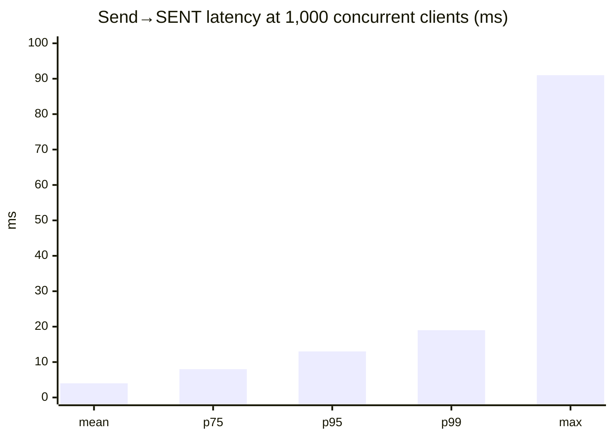
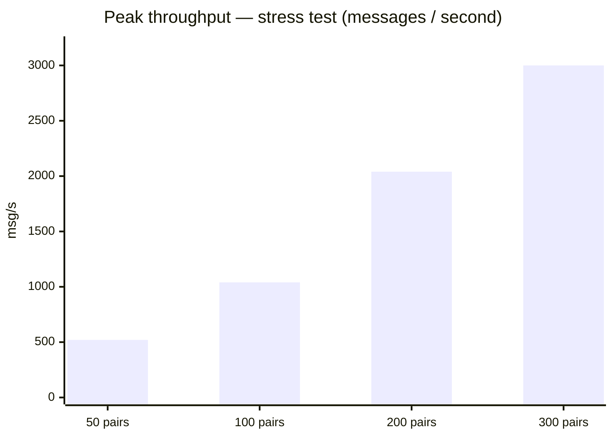

# 📨 Hormigas Messenger

> Real-time **master ↔ client chat** for the Hormigas services marketplace — a reactive,
> guaranteed-delivery WebSocket service built on **Java 25 + Quarkus + Mutiny** with a clean
> **Hexagonal** core.
>
> 🌍 Other languages: [Russian](./README.ru.md)

It runs alongside the other Hormigas services (MasterProfile `:8080`, ClientProfile `:8081`,
Order/TaskManager `:8082`) and gives the two parties of a job — a **master** and a **client** —
one place to coordinate: discuss scope, agree terms, share files, and receive system notifications.

> **Source-of-truth note.** This README is generated from the approved **concept** and the
> **functional requirements (FR)** held in the architecture digital twin
> (`knowledge/concepts/messenger-{concept,use-cases,functional-requirements}.md`). The twin docs
> remain authoritative; this README is the public-facing view.

---

## 📘 Contents

- [What it is](#-what-it-is)
- [Conversation model](#-conversation-model)
- [Message kinds & handling strategies](#-message-kinds--handling-strategies)
- [Message states & lifecycle](#-message-states--lifecycle)
- [Mutability, freeze & retention](#-mutability-freeze--retention)
- [Core guarantees](#-core-guarantees)
- [Architecture — Hexagonal core + reactive pipeline](#-architecture--hexagonal-core--reactive-pipeline)
- [Delivery engine — Outbox + History + Watermark/Tetris GC](#-delivery-engine--outbox--history--watermarktetris-gc)
- [Presence ↔ GC coupling](#-presence--gc-coupling)
- [Idempotency](#-idempotency)
- [Reconnect & history sync](#-reconnect--history-sync)
- [Authentication & authorization](#-authentication--authorization)
- [HTTP & WebSocket API](#-http--websocket-api)
- [Configuration](#-configuration)
- [Persistence schema](#-persistence-schema)
- [Build, run & test](#-build-run--test)
- [Status vs functional requirements](#-status-vs-functional-requirements)
- [Roadmap & deferred work](#-roadmap--deferred-work)
- [Project structure](#-project-structure)
- [Appendix A — Tetris ACK/GC model](#-appendix-a--tetris-ackgc-model)
- [Appendix B — Glossary](#-appendix-b--glossary)

---

## 🚀 What it is

A **reactive pipeline** messenger: every message flows through asynchronous stages
(validate → persist → ACK → deliver → finalize) that a resolver assembles on the fly from the
message type. **Ports and adapters** wall the **clean domain (core)** off from infrastructure, so
PostgreSQL, Redis and WebSocket transports swap out without touching business logic.

### Core technologies

| Component | Technology | Purpose |
|-----------|-----------|---------|
| ☕ **Java 25** | Language | Records, pattern matching, performance |
| ⚡ **Quarkus 3.32** | Framework | Fast startup, low footprint, `websockets-next` |
| 🔁 **Mutiny** | Reactive library | Non-blocking `Uni` pipelines |
| 🧠 **Hexagonal architecture** | Pattern | Domain isolated from infrastructure |
| 🧱 **PostgreSQL** (reactive PG client + Flyway) | Durable store | Outbox + message History + conversations |
| ⚙️ **Redis** | In-memory state | Presence, idempotency, Tetris watermarks |
| 🔐 **Ory** (Kratos + Oathkeeper) | Identity | Proxy-injected identity headers (no JWT in-app) |
| 🌐 **API Gateway** | Edge | TLS, identity injection, WS routing, future sharding |

---

## 🧭 Conversation model

- **Identity** — a conversation is the **pair `(clientId, masterId)`** (two Ory identities).
  **1:1 only; no group chats.**
- **Creation is service-to-service / admin only** — chats are **provisioned by the platform**, never
  by an end client. One core *create-chat* operation (idempotent on the pair → the existing chat is
  returned, never duplicated), invoked by interchangeable inbound adapters:
  - ✅ **Order event** adapter — a master expresses interest / a new order (Kafka `order.events`) →
    creates the `(client, master)` chat with the `orderId` as metadata (UC-H01).
  - ✅ **REST** adapter (`POST /api/chats`) — restricted to callers the Ory edge marks
    **`X-Role` ∈ {ADMIN, SERVICE}**; a client caller gets `403`.
- **Order-agnostic** — **one conversation per pair, reused across orders.** The messenger never
  models/branches/groups by order; the `orderId` travels only as **opaque metadata** the platform
  sets at creation. Grouping by order is a **frontend** concern.
- **Delete is "delete for me" (per participant, watermark)** — deleting a chat sets that participant's
  **delete watermark** to the chat's latest message; their history and chat list are filtered below it
  for **them only**. The peer is unaffected, rows are never removed (admins see everything), and a new
  message (e.g. a new order's) above the watermark **revives** the chat in their list automatically.
  A participant can read their deleted history back with `?includeDeleted=true`. Delete does **not**
  stop messaging.
- **Blacklist/block (per participant, mutual)** — either side can block the other; while blocked,
  sending between them is rejected for **both**. Unblock restores messaging. Block is the only
  terminal messaging stop (delete is not). A blocked chat still **appears** in the caller's list.

> **Dual-driven principle.** Every event-capable operation (create chat, freeze) is **one core use
> case** exposed via **two inbound adapters — REST and an event consumer**. Triggers are
> interchangeable; the use case is the mechanism. (Both are live today: the REST endpoint and the Kafka `order.events` consumer.)

---

## 💬 Message kinds & handling strategies

Each message kind maps to one of four **handling strategies** (orthogonal properties, resolved per
`MessageType`):

| Strategy | Durably persisted | Retried until ACK | Idempotent | Kept in History | Used for |
|----------|:---:|:---:|:---:|:---:|----------|
| **A — persistent** | yes | yes | yes | yes (until TTL; frozen → own longer TTL) | chat messages |
| **B — fire-and-forget** | no | no | no | no | typing, presence |
| **C — retry-then-purge** | transient (outbox) | yes | yes | no | must-arrive system notices |
| **S — signaling** | no (transient) | yes | yes | no | **WebRTC** call setup |

> All four are implemented: **A** (chat), **S** (signaling), **B** (presence), and **C** — must-arrive
> system notices delivered over the dedicated `OUTBOUND_TRANSIENT` pipeline, durable as an eager
> `dead_letter` draft that a `SYSTEM_ACK` retracts (ADR-014).

### Wire `MessageType` values

```
CHAT_IN     CHAT_OUT     CHAT_ACK        # persistent chat (Strategy A) + delivery ACK
READ_IN     READ_OUT                     # read receipts (Strategy B): reader → server, server → sender
SIGNAL_IN   SIGNAL_OUT   SIGNAL_ACK      # WebRTC signaling (Strategy S)
PRESENT_INIT  PRESENT_JOIN  PRESENT_LEAVE   # presence (Strategy B)
SERVICE_OUT                              # server→client technical message
```

The server assigns the canonical `messageId` (a **ULID** — time-monotonic) on inbound; the client's
own id travels as `correlationId` for ACK matching and frontend dedup.

---

## 🔄 Message states & lifecycle

Persisted status machine: **`SENT → DELIVERED → READ`**.

- **SENT** — message durably written (History + Outbox in one transaction) and ACKed to the sender.
- **DELIVERED** — set when the **recipient sends a delivery ACK** (`CHAT_ACK`, `correlationId` = the
  delivered messageId). A WS push is best-effort, so DELIVERED means ACK-confirmed — never merely push-assumed. That
  same ACK also advances the GC watermark.
- **READ** — the recipient sends a `READ_IN` over WS (fire-and-forget); the server persists `READ`
  and pushes a `READ_OUT` to the sender (same realtime channel as DELIVERED). `POST /api/chats/{id}/read`
  is the reconnect/bulk fallback — both go through the same core `markRead`.

### Persistent (Strategy A) happy path

1. Client → WS `CHAT_IN` `{conversationId, messageId, payload, metadata{orderId}}`.
2. **Validate** — membership (sender in the pair, not blacklisted), format, timezone.
3. **Persist atomically** — History + Outbox in a single transaction.
4. **ACK sender** (`CHAT_ACK`, status `SENT`).
5. **Deliver** — if the recipient is online, push `CHAT_OUT` (→ `DELIVERED`); else hold in Outbox.
6. **Read receipt** → status `READ`.
7. **GC** — remove Outbox rows ≤ the safe-delete watermark; History is retained per TTL.

---

## 🧊 Mutability, freeze & retention

- **Immutable** — messages are write-once; **there is no edit operation.**
- **Conditional delete** — a participant may delete a message **only while it is NOT frozen**;
  a frozen message → `409`.
- **Freeze is message-level, scoped by `orderId`** — there is **no chat-level freeze**. When the
  parties reach a contract for an order, *that order's* messages are frozen (one-way) and become
  immutable evidence. A sibling order's messages in the **same** chat stay deletable.
  `POST /api/chats/{id}/freeze {"orderId": "..."}`.
- **Retention classes** — normal history uses the per-kind TTL; **frozen** messages have their
  **own, longer** TTL (a separate class, not exemption). The repository honours both
  (`deleteOlderThan` excludes frozen; `deleteFrozenOlderThan` for the frozen class), and a scheduled
  sweep (`HistoryRetentionScheduler`) applies each class on its own cadence.

---

## 🧾 Core guarantees

1. **Persistent chat — never lost.** Stored durably before any ACK.
2. **Offline delivery.** Held in Outbox and delivered on the recipient's next connection.
3. **At-least-once + best-effort idempotency.** The server strives not to resend; exactly-once is
   **not** guaranteed — the **frontend dedups by `messageId`**.
4. **Read receipts** persisted (`SENT → DELIVERED → READ`).
5. **Per-conversation ordering** — *targeted; not yet implemented* (see Roadmap).
6. **Single active session per user.** A new WS connection for a client evicts the previous one
   (clean takeover). Multi-device is out of scope for v1 (per-client ACK/watermark/ordering).

### 📐 Delivery contract & invariants

The system guarantees **no loss with at-least-once delivery** — not a live push. Precisely:

- **`message_history` is the single source of truth** and never loses a message within its retention
  TTL (frozen messages get a longer class). The **Outbox is a transient delivery buffer** and *may*
  drop a message before an offline recipient ever receives it live.
- History and Outbox rows are written in **one transaction**, so anything in the Outbox is already in
  History (`persist → visible via REST → eligible for GC`, in that order).
- **GC deletes `outbox WHERE id < safe`**, where `safe` is the lowest *un-ACKed* id; the pending row
  itself is never deleted. The safe boundary advances on a **recipient ACK** *or* on **disconnect**
  (an offline client's pending rows become collectable — they remain in History).
- A client is treated as **offline** by the GC on connection close / ACK; presence (Redis) gates only
  *live delivery attempts*. A network glitch may cause a transient false-offline, which is safe: data
  stays in History and the client recovers via REST on reconnect.
- **On (re)connect the client pulls history via REST, then resumes WS.** No message is lost across
  the gap; duplicates are possible (REST page + live), so the **client dedups by `messageId`**.

---

## 🧱 Architecture — Hexagonal core + reactive pipeline

```
domain/   — framework-free models (Message, Conversation, ClientData, …) and contracts
core/     — business logic: pipeline stages, resolver, pollers, watermark, presence, GC
ports/    — driving/driven interfaces (history, outbox, channel, presence, tetris, message, …)
infrastructure/ — adapters: Postgres, Redis, WebSocket, REST
```

The **pipeline** is a state machine assembled per message type by a resolver
(`EnumMap<MessageType, PipelineType>`):

1. **Validation** — integrity, membership, access.
2. **Persist** — History + Outbox (Strategy A), via a port.
3. **ACK** — to the sender.
4. **Cache** — Redis for idempotency/fast access (cached strategies).
5. **Delivery** — over WebSocket; marks `DELIVERED` on a successful push.
6. **Finalization** — error handling / compensation.

A **HexagonalArchitectureTest** (ArchUnit) enforces the layering at build time: the domain stays
framework-free, the core depends only on ports, and ports never reach back into core or infrastructure.

### Reactive model & load management

Stages run asynchronously, with reactive buffers between them; under overload, outbox reading
throttles itself (adaptive `Regulator` feedback) and recovers on its own. Every throughput, latency
and buffer metric exports to **Prometheus** (`/q/metrics`).

---

## 🗄️ Delivery engine — Outbox + History + Watermark/Tetris GC

- **Own PostgreSQL outbox.** Incoming persistent messages land in `outbox`; a poller reads directly
  from Postgres (**no Kafka in the internal engine**), delivers, and rows are cleaned once confirmed.
- **History** is the durable source of truth; **Outbox** is the live delivery buffer.
- **Leasing.** The poller claims a batch in **one statement** —
  `UPDATE outbox … FROM (SELECT id … WHERE lease_until <= now() ORDER BY id LIMIT n FOR UPDATE SKIP LOCKED) … RETURNING …` —
  so multiple instances never process the same row, with a single round-trip per poll.
- **"Tetris" watermark GC.** Per-recipient ACK ranges are merged in **Redis** (ZSETs + atomic **Lua**
  scripts) to compute the **global safe-delete id**; the GC deletes `outbox WHERE id < safe`. History is
  retained per TTL. Scripts run via `EVALSHA` with a **`NOSCRIPT` fallback** (survives a Redis
  restart); startup cleanup uses `SCAN` + `UNLINK` (never the blocking `KEYS`). See
  [Appendix A](#-appendix-a--tetris-ackgc-model).
- **Redis is a rebuildable cache; the Outbox is the durable truth.** The Tetris state can be lost
  (flush / cold start) without data loss: the GC is **gated on a `tetris:primed` flag** and, when
  unprimed, **rehydrates the pending set from the Outbox** (`recipientId → row ids`) before computing
  `safe`. So GC can never advance past — and prematurely trim — undelivered rows the cache has
  forgotten. (A Redis cluster makes loss rare; rehydration makes it safe regardless.)

---

## 🟢 Presence ↔ GC coupling

Presence is a **correctness dependency of GC**: the watermark advances on delivery, and delivery
demands an *accurately* online recipient — one phantom-online client stalls GC. Therefore:

- **Presence (Redis)** gates *live delivery attempts* (offline → hold in Outbox); it is **not** the
  GC's source of truth. The GC watermark advances on a **recipient ACK** or on **connection close**.
- **Mark OFFLINE on delivery failure** — if a live push to an open session fails, the recipient is
  transitioned OFFLINE so the poller stops phantom-online retries and simply holds in Outbox.
- **Heartbeat / ping → reap.** The server auto-pings; a live client's `pong` refreshes its activity
  (`@OnPongMessage`). A connection that stops responding past `processing.session.idle-timeout-ms`
  (default 35 s) is **force-closed** by the liveness reaper → `@OnClose` → presence/watermark cleanup.
  This keeps presence honest and prevents phantom-online GC stalls.

---

## 🛡️ Idempotency

- **Server:** best-effort dedup through a short-TTL buffer keyed by `messageId` (Redis), sized to
  absorb network + ACK-flush + scheduler latency.
- **Client:** authoritative dedup by `messageId` — which is why exactly-once is not a server goal.
  Rare wire duplicates are acceptable; the user never sees one.

---

## 🔌 Reconnect & history sync

On (re)connect a client **pulls its conversation history via REST**, then resumes live WS delivery.
That read-through is exactly what guarantees nothing slips through across disconnects.

History sync is **conversation-scoped and cursor-paginated**:
`GET /api/chats/{id}/messages?since=<last messageId>&limit=<n>` (default 200, max 500). Because
`messageId` is a ULID, it doubles as the page cursor (`WHERE message_id > $since ORDER BY message_id`).
The effective floor is `max(since, the caller's delete watermark)`, so a chat the caller deleted
syncs only its post-delete messages — pass `includeDeleted=true` to read the deleted history back.

---

## 🔐 Authentication & authorization

- **Ory** identity, injected by the edge (Oathkeeper) as headers — the service trusts them, it does
  **not** validate JWTs itself:

  | Header | Meaning |
  |--------|---------|
  | `X-User-Id` | caller identity (required) |
  | `X-User` | display name |
  | `X-Role` | `MASTER` / `CLIENT` |
  | `X-User-Email` | email |

  Missing/blank identity → WS close / HTTP `401`.
- **Authorization by conversation membership** — only the two participants may read/write a chat;
  others get `403`. Blacklisted pairs cannot message.

---

## 🌐 HTTP & WebSocket API

### WebSocket protocol

Connect to `ws://<host>/ws` with the **Ory identity headers on the handshake** (same as REST). The
server treats the session's `X-User-Id` as the authenticated sender, and every frame is a JSON `Message` object.

**Frame schema** (fields used vary by `type`):

| field | set by | meaning |
|-------|--------|---------|
| `type` | both | the `MessageType` (tables below) |
| `senderId` / `recipientId` | client (inbound) / server (outbound) | identities |
| `conversationId` | both | chat id (the `(client,master)` pair); `system:<id>` for system notices |
| `messageId` | client on send → **server reassigns a ULID** | server id is monotonic + the history page cursor |
| `correlationId` | both | links an ACK/receipt to the referenced `messageId` |
| `ackId` | client on `*_ACK` | the outbox row id being acked (advances the GC watermark) |
| `payload.kind` / `payload.body` | both | `text` · `custom` · `event` · `attachment`; `body` = content/reference |
| `meta` | both | opaque string map (e.g. `orderId`, attachment `objectKey/fileName/...`) |
| `senderTimestamp` / `senderTimezone` | client | epoch ms + IANA tz (validated, ≤ 5 min skew) |
| `serverTimestamp` / `id` / `sequenceNumber` | server | server-assigned |

**Inbound — client → server** (only these are accepted; others rejected):

| `type` | purpose |
|--------|---------|
| `CHAT_IN` | send a chat message (persistent, Strategy A) — membership + blacklist guarded |
| `SIGNAL_IN` | WebRTC offer/answer/ICE (Strategy S, ephemeral) — same membership guard |
| `TYPING_IN` | typing indicator (Strategy S, transient) — membership/block guarded, delivered live as `TYPING_OUT`, **never persisted** |
| `CHAT_ACK` | recipient delivery-ACK: `correlationId`=delivered `messageId`, `ackId`=outbox id → `SENT→DELIVERED` |
| `READ_IN` | recipient read the conversation → marks `READ` + pushes `READ_OUT` to the sender |
| `SYSTEM_ACK` | confirm a system notice: `correlationId`=notice `messageId` → retracts the dead-letter draft |

**Outbound — server → client:**

| `type` | purpose |
|--------|---------|
| `CHAT_OUT` | a delivered chat message |
| `CHAT_ACK` | `SENT` receipt back to the sender (`correlationId` = the sent `messageId`) |
| `SIGNAL_OUT` | a delivered signaling frame |
| `TYPING_OUT` | peer is typing (transient) |
| `READ_OUT` | "your messages were read" → the original sender |
| `PRESENT_INIT` / `PRESENT_JOIN` / `PRESENT_LEAVE` | presence snapshot / peer online / peer offline |
| `SYSTEM_OUT` | a must-arrive system notice (Strategy C) — confirm with `SYSTEM_ACK` |
| `SERVICE_OUT` | transient service notice (e.g. ingress overload / backpressure) |

Delivery is **at-least-once**; the client **dedups by `messageId`** and **re-sorts by the monotonic
id** (ordering is client-authoritative). Missing/blank identity on the handshake → the socket is closed.

### REST — `/api/chats`

| Method & path | Purpose | Notable responses |
|---------------|---------|-------------------|
| `POST /api/chats` | Create/return chat for `{clientId, masterId, metadata}` (idempotent). **ADMIN/SERVICE only** — clients cannot create chats | `201` created / `200` existing / `403` non-service |
| `GET /api/chats` | List the caller's chats — recent-first, **includes blocked**, excludes the caller's deleted chats (until a newer message revives them) | `200` |
| `GET /api/chats/{id}/messages?since=&limit=&includeDeleted=` | Cursor-paginated history (membership-gated). Floored at the caller's delete watermark unless `includeDeleted=true` | `200` / `403` / `404` |
| `DELETE /api/chats/{id}` | Delete the chat **for the caller** ("delete for me" — sets their watermark; reversible by new activity) | `204` |
| `POST /api/chats/{id}/block` · `DELETE …/block` | Blacklist / unblock the peer (mutual; the only terminal messaging stop) | `204` |
| `DELETE /api/chats/{id}/messages/{messageId}` | Delete a message (only if not frozen) | `204` / `404` / `409` frozen |
| `POST /api/chats/{id}/freeze` `{orderId}` | Freeze that order's messages (one-way) | `200 {frozen:n}` / `400` no orderId |
| `POST /api/chats/{id}/read` | Recipient marks READ (reconnect/bulk **fallback**; primary is WS `READ_IN`) | `200 {read:n}` |
| `GET /api/chats/{id}/receipts` | Per-message status (`SENT`/`DELIVERED`/`READ`) | `200` |

### REST — auxiliary

| Method & path | Purpose |
|---------------|---------|
| `GET /api/history` | Caller-scoped message history |
| `GET /api/presence` | Presence snapshot |
| `POST /api/chats/{id}/attachments/upload-url` · `…/{aid}/confirm` · `GET …/{aid}/download-url` | Two-phase presigned attachment upload (ADR-010) |
| `POST /api/system/notify` | Emit a must-arrive system notice (Strategy C) — **ADMIN/SERVICE only** |
| `GET /q/health`, `GET /q/metrics` | Health & Prometheus metrics |
| `GET /q/openapi`, `GET /q/swagger-ui` | OpenAPI spec + Swagger UI (REST) |

### REST — admin console (`/api/admin/chats`, **ADMIN only**)

Platform-wide reads for operators. Unlike the participant endpoints these are **not membership-gated
and not per-side filtered** — an admin sees every chat regardless of who deleted or blocked it. A
non-ADMIN caller (incl. `SERVICE`) gets `403`.

| Method & path | Purpose | Notable responses |
|---------------|---------|-------------------|
| `GET /api/admin/chats?participant=&conversationId=&blocked=&from=&to=&sort=&limit=&offset=` | List all chats with filters (participant on either side, single id, `blocked=true`, `created_at` range `from`/`to` as ISO-8601), `sort` ∈ `created_asc\|created_desc\|updated_asc\|updated_desc`, paging (`limit` ≤ 200, default 50). Returns `{items, total, limit, offset}` | `200` / `400` bad filter / `403` |
| `GET /api/admin/chats/stats` | Platform counts `{total, blocked}` | `200` / `403` |

### Kafka — `order.events` (inbound)

The service **consumes** `order.events` (channel `order-events-in`, SmallRye Kafka) — the second
driving adapter riding the same create-chat / freeze core ops (concept §2, ADR-007). JSON envelope:

```jsonc
{
  "eventId":    "uuid",                 // producer dedup key (at-least-once; consumer is idempotent)
  "eventType":  "order.master.interested",
  "occurredAt": "2026-06-24T10:00:00Z",
  "payload": { "clientId": "...", "masterId": "...", "orderId": "..." }  // Ory identity ids + opaque orderId
}
```

| `eventType` (config-driven) | action |
|-----------------------------|--------|
| `order.master.interested` (`messenger.order-events.type.master-interested`) | **UC-H01** create the `(client,master)` chat (idempotent, `orderId` as metadata) |
| `order.contract.concluded` (`messenger.order-events.type.contract-reached`) | **UC-H04** resolve the chat by pair → freeze that order's messages |

> **Assumed contract — reconcile with the Order team.** The envelope mirrors ADR-007; the concrete
> `eventType` strings are config (`messenger.order-events.type.*`), so reconciliation is config, not code.

---

## ⚙️ Configuration

Runs under the **`prod`** profile; all hosts/secrets are environment-parameterised (never hardcoded).

| Env var | Default | Purpose |
|---------|---------|---------|
| `DB_HOST` / `DB_PORT` / `DB_NAME` / `DB_USER` / `DB_PASSWORD` | `postgres` / `5432` / `hormigasdb` / `ant` / `ant` | PostgreSQL (history, outbox, conversation, attachment, dead_letter) |
| `REDIS_HOST` / `REDIS_PORT` | `redis` / `6379` | Redis (presence, idempotency, Tetris watermark, dead-letter confirmed-set) |
| `KAFKA_BOOTSTRAP_SERVERS` | `localhost:9092` | inbound `order.events` consumer. Must be a **resolvable** host even if the broker/topic is absent (consumer retries; readiness not gated on it). |
| `MINIO_ENDPOINT` | `http://localhost:9000` | MinIO for attachments. **Must be browser-reachable** — it is baked into presigned URLs. Override per env. |
| `MINIO_ACCESS_KEY` / `MINIO_SECRET_KEY` / `MINIO_BUCKET` | `hormiga` / `hormiga123` / `messenger-attachments` | MinIO credentials + bucket (created lazily). |

Tunables live under `processing.*` in `application.yaml` (outbound batch size, poll interval,
adaptive feedback factors, channel retry/backoff, credits, Tetris collector, idempotency TTL,
attachment size/orphan-age, dead-letter cleanup interval, `messenger.order-events.type.*`).
WebSocket max message size is 64 KiB.

---

## 🚀 Performance

**1,000 concurrent clients holding real conversations is a fraction of capacity.** A 5-minute soak
with **1,000 live WebSocket sessions** (500 chat pairs) — taking turns with human think-time, marking
messages read, and 30 % of them dropping & reconnecting mid-chat — ran at **p95 13 ms, zero server
drops, zero full GC**, with heap flat ~88 MB and RSS settled ~0.72 GB under a bounded JVM.



And the **peak capacity** (synthetic stress test, think-time removed) is **~3,000 messages/second,
sustained, at a 20 ms p95** — held flat for minutes with no message loss and no full GC. Well past the
≥ 1,000 msg/s target.



The lever is a **parallel inbound pipeline that group-commits the `history+outbox` writes**: many
messages are coalesced into a single transaction (`InboundPersistBatcher`), several transactions run
concurrently, and a rolled-back batch retries row-by-row so one bad message fails alone. Everything
below the persist — delivery, the `SENT` ack, caching, the watermark — stays strictly per-message.

📈 **Full report — scaling curve, memory profile, charts and tuning: [`docs/PERFORMANCE.md`](docs/PERFORMANCE.md).**

## ⚡ Performance tuning

All knobs live under `processing.*` in `application.yaml`, are env-overridable, and apply in the `prod` profile. Defaults below are the shipped values.

| Group | Param | Default | What it does | Raise ↑ / Lower ↓ |
|---|---|---|---|---|
| Inbound backpressure | `processing.messages.inbound.queue-size` | `3000` | Admission gate on in-flight inbound (client→router) messages; over the cap `publish()` records a drop and emits a `SERVICE_OUT` overload notice. The only bound on the inbound path (Mutiny buffers unconditionally behind it). The publisher runs **PARALLEL** so many `routeIn` flows run at once (feeds the persist batcher below). | ↑ fewer drops/overload notices in bursts, but more retained `Message` graphs (heap/GC).<br>↓ bounded memory + lower queueing latency, but sheds load and surfaces overload sooner. |
| Inbound persist (plan B) | `processing.messages.inbound.persist-batch.max-size` | `64` | Max messages coalesced into one `history+outbox` transaction. The single biggest throughput lever — profiling showed the per-message persist round-trip, serialized, was the whole ceiling (load findings R1→R3: ~9× at 200 pairs, p95 ~50× lower). | ↑ fatter transactions, fewer commits/fsync, higher peak throughput; a rolled-back batch retries more rows individually.<br>↓ smaller batches → more commits, approaches the old 1-tx-per-message cost. |
| Inbound persist (plan B) | `processing.messages.inbound.persist-batch.linger-ms` | `5` | Max time a partial batch waits before flushing — the only latency this adds to a message. | ↑ lets batches fill more under light load (better amortization) at the cost of that much added send→persist latency.<br>↓ flushes sooner (lower latency), smaller batches under light load. |
| Inbound persist (plan B) | `processing.messages.inbound.persist-batch.max-concurrent-batches` | `8` | Batch transactions in flight at once (`merge(N)`). Fills the otherwise ~95%-idle DB pool. | ↑ more parallel persists → higher throughput until the DB or pool saturates. **Keep ≤ the DB pool size (20).** ↓ fewer concurrent transactions, lower DB contention, lower ceiling. |
| Outbox / outbound | `processing.messages.outbound.batch-size` | `1500` | Max rows claimed per outbox drain (`LIMIT` in the SKIP-LOCKED claim); each row is leased (5s) and emitted one-by-one into the outbound stream. Floored to 50. | ↑ drains backlog in fewer cycles, amortizes the claim cost, but bursts the outbound queue and raises per-poll heap/GC.<br>↓ slower drain/recovery, gentler bursts. Keep `< queue-size`. |
| Outbox / outbound | `processing.messages.outbound.queue-size` | `5000` | Hard capacity of the in-memory outbound dispatch queue; over it `publish()` drops. Also gates the poller — it only fetches when the queue is empty. | ↑ tolerates bigger publish bursts before drops, at a larger worst-case heap.<br>↓ saturates and drops sooner; re-polls sooner. |
| Outbox / outbound | `processing.messages.outbound.polling-ms` | `1000` | Base outbox poll cadence (`@Scheduled`, SKIP guards re-entry); also the floor the feedback regulator modulates upward. | ↑ less CPU/DB poll traffic, higher redelivery latency.<br>↓ lower latency + faster drain, but more wake-ups and SKIP-LOCKED queries even when idle. Sets the best-case latency floor. |
| Adaptive feedback | `processing.messages.feedback.additional-ms` | `1000` | Base added poll delay and the floor the adaptive interval decays back to. | ↑ slower baseline drain (poller never polls faster than this).<br>↓ tighter stable-state loop, lower latency, more DB polls. |
| Adaptive feedback | `processing.messages.feedback.adjustment-factor` | `2.0` | Multiplicative back-off (>1) applied to the interval on a drop event. | ↑ steeper back-off — sheds load faster but overshoots/idles the outbox.<br>↓ gentler — stays fast under load but risks sustained drops. |
| Adaptive feedback | `processing.messages.feedback.recovery-factor` | `0.5` | Decay multiplier (<1) applied on a stable health event, shrinking the inflated interval toward `additional-ms`. | ↑ (→1) slower, steadier recovery; prolonged latency after a burst.<br>↓ (→0) snaps back to fast polling, but risks oscillation. |
| Adaptive feedback | `processing.messages.feedback.max-ms` | `30000` | Hard ceiling on the adaptive added delay. | ↑ harder load-shedding under sustained overload, but worst-case redelivery latency/backlog grows.<br>↓ bounds tail latency, but keeps hitting the DB. |
| Delivery retry | `processing.messages.channel.retry` | `true` | Master on/off for per-delivery WS-push retry with backoff in `DeliveryStage`. | ↑ `true` retries transient socket failures up to `max-retries`.<br>↓ `false` makes the first failure final — lower latency/memory, higher immediate drop-rate. |
| Delivery retry | `processing.messages.channel.min-backoff-ms` | `300` | Initial backoff before the first retry (base of the jittered exponential). | ↑ gives a flapping client more time to recover, longer in-flight retention/latency.<br>↓ retries sooner, hammers an unhealthy socket and burns the budget. |
| Delivery retry | `processing.messages.channel.max-backoff-ms` | `1000` | Ceiling on the growing backoff between retries. | ↑ stretches tail latency to buy a lower drop-rate on slow-recovering sockets.<br>↓ caps latency, frees resources, but wastes the budget on clients needing more time. |
| Delivery retry | `processing.messages.channel.max-retries` | `3` | Retry attempts after the initial delivery before the delivery errors out (→ offline/outbox paths). | ↑ lower effective drop-rate, but linearly more in-flight retention, CPU and worst-case latency.<br>↓ fails fast, frees resources, higher first-failure drop-rate. (With defaults, worst-case added delay ≈ 300+600+1000 ≈ ~1.9s before final failure.) |
| Outbox GC | `processing.messages.collector.every-s` | `10` | Period of the watermark GC sweep that `DELETE`s outbox rows below the global safe-delete id (SKIP guards overlap). Only ever reclaims already-safe rows. | ↑ table grows between sweeps, bigger per-sweep DELETE/lock/WAL, fewer Redis round-trips.<br>↓ leaner table/index, cheaper scans, more Redis+DELETE traffic. No latency/drop-rate effect. |
| Outbox GC | `processing.messages.collector.max-watermarks` | `100` | **Inert / reserved** — bound but has no runtime consumer; changing it has no observable effect today. Flag for cleanup (wire it or remove it). | No effect. |
| Idempotency | `processing.messages.idempotent.ttl-seconds` | `30` | TTL of the Redis dedup key for a delivered message; the window in which a redelivery is recognized as a duplicate and suppressed (ACK retracts it sooner). | ↑ more robust dedup across retries/reconnects, more resident Redis keys.<br>↓ frees memory, but redeliveries arriving after expiry can double-deliver. Keep above the realistic retry/poll/feedback horizon. |
| Attachments | `processing.attachments.max-size-bytes` | `26214400` | Hard cap (25 MiB) on a single upload, checked against the client-declared size at `requestUpload` before any row/presigned URL (advisory; skipped if size is null). | ↑ permits larger files — more MinIO storage and bigger presigned GET transfers.<br>↓ rejects more uploads early; too low blocks legitimate documents. |
| Attachments | `processing.attachments.orphan-age-seconds` | `3600` | Grace period before the reaper reclaims an unconfirmed `PENDING` attachment (CONFIRMED untouched). Must exceed `minio.upload-ttl-seconds` (600). | ↑ orphaned rows/objects linger, bigger reaper scans.<br>↓ frees storage sooner, but below the upload window risks reaping in-flight uploads (false reclaim). |
| Attachments | `processing.attachments.cleanup-every` | `15m` | `@Scheduled` period of the orphan-reclaim job (prod-only, SKIP, BATCH=200/tick). Quarkus duration string. | ↑ slower backlog drain, dead objects persist longer, less DB/MinIO load.<br>↓ tighter storage, faster drain, more scans/deletes. No live-path latency effect. |
| Dead-letter | `processing.deadletter.cleanup-every` | `30s` | Period of the dead-letter retract sweep (confirm→delete→clear, SKIP, BATCH=500/tick). Default is the inline annotation literal — the key is absent from `application.yaml`. | ↑ confirmed drafts + Redis confirmed-set linger, less DB/Redis traffic.<br>↓ fresher audit table, but a full `SMEMBERS` + DELETE every tick. Keep low enough that 500/tick keeps pace with the ACK rate. |

### Trade-offs (cross-cutting)

- **Bigger inbound/outbound queues + batch-size** → more RAM and higher latency-under-overload (deeper backlogs), but fewer drops. Keep `batch-size < outbound queue-size` or a drain burst fills the queue and starts dropping.
- **Inbound persist group-commit (plan B)** → `persist-batch.{max-size, linger-ms, max-concurrent-batches}` set the inbound write throughput. Bigger size + more concurrency = higher ceiling; the only cost is `linger-ms` of added latency per message and `max-size` rows at risk if a batch transaction rolls back (it then retries each individually). Keep `max-concurrent-batches ≤ DB pool size`.
- **Faster `polling-ms` / lower `additional-ms`** → lower delivery latency and faster drain, but more DB SKIP-LOCKED claims and Redis round-trips per second, even when idle.
- **Aggressive feedback growth (`adjustment-factor` ↑, `recovery-factor` →1)** → sheds load and cuts drops faster with fewer wasted polls, but slower drain and higher tail latency after a burst clears; a low `recovery-factor` recovers fast but can oscillate.
- **Idempotent `ttl-seconds` too low** → redeliveries lapse the dedup window and double-deliver; **too high** → more resident Redis keys (memory). Keep it above the retry + poll + max feedback-delay horizon.
- **Collector `every-s` too high** → outbox table/index bloat and bigger per-sweep DELETEs (GC only reclaims already-safe rows, never affects latency/drops); **dead-letter `cleanup-every` too high** → the Postgres `dead_letter` table and the unbounded Redis confirmed-set grow without bound.

---

## 🧮 Persistence schema

Flyway migrations (`src/main/resources/db/migration`):

| Migration | Adds |
|-----------|------|
| `V2` | `message_history` + `outbox` (atomic insert) |
| `V3` | `conversation` (pair, JSONB metadata) |
| `V4` | per-participant hide / block flags |
| `V5` | `message_history.frozen` |
| `V6` | `message_history.status` (`SENT`/`DELIVERED`/`READ`) |
| `V7` | `message_history.order_id` (+ index) — queryable order key for order-scoped freeze |

---

## 🛠️ Build, run & test

**Build & unit/integration tests** (JDK 25; Dev Services spins up PostgreSQL + Redis in Docker):

```bash
JAVA_HOME=/path/to/jdk-25 ./mvnw test
```

**Run locally** (against local infra, prod profile):

```bash
docker compose -f e2etests/docker-compose.yml up -d        # Postgres + Redis (+ MinIO)
./mvnw -DskipTests package
DB_HOST=localhost REDIS_HOST=localhost \
  java -Dquarkus.profile=prod -jar target/quarkus-app/quarkus-run.jar   # → :8080
```

**End-to-end acceptance** (app + infra must be up). REST is driven by **Karate** (OSS 1.4.1); all
**live-WebSocket** scenarios are driven by a **JUnit suite over the JDK's built-in
`java.net.http.WebSocket`** (`e2etests/.../hormiga/ws/*WsTest`) — Karate 2.x paywalls WebSocket and
1.4.1's GraalVM JS handler can't build on this JDK (ADR-015). One `mvn test` runs both:

```bash
cd e2etests && JAVA_HOME=/path/to/jdk-21 mvn test -Dkarate.env=dev      # 20 Karate REST + 9 WS
```

Current coverage: **≈298 unit/integration tests** (`./mvnw test`, JDK 25) **+ 29 e2e** (20 Karate REST
+ 9 JDK-WebSocket), all green. The WS suite covers delivery, SENT→DELIVERED→READ, signaling, presence,
offline→reconnect redelivery, and Strategy-C system notices.

**Load testing** (`loadtest/`, Gatling) — each virtual user is a chat pair (create chat → connect
master+client WS → stream CHAT_IN), so the full inbound pipeline + persistence + delivery + Tetris
run under load. Against a running app:

```bash
cd loadtest && JAVA_HOME=/path/to/jdk-21 mvn gatling:test \
  -Dgatling.simulationClass=load.MessengerLoadSimulation \
  -Dload.users=200 -Dload.ramp=60 -Dload.msgs=30        # → HTML report under target/gatling/
```

Watch the server side in parallel via Prometheus `/q/metrics` (queue depth, outbox lag, safe-delete
watermark, WS sessions, JVM/Redis).

---

## 🚢 Deployment

Same model as the Order service ([`TaskManager/docker-compose.yml`](../TaskManager/docker-compose.yml)):
run the pre-built `quarkus-app` jar on a `temurin:25` base, bind to the **shared platform services**
(PostgreSQL, Redis, MinIO, Kafka) **by hostname via env vars**, join the external shared network.

```bash
cd ../MasterProfile && docker compose up -d                  # parent stack: postgres/redis/minio/kafka
cd ../HormigaMessanger
JAVA_HOME=/path/to/jdk-25 ./mvnw -DskipTests package
mkdir -p messenger && cp -r target/quarkus-app messenger/quarkus-app    # stage the built app
MINIO_ENDPOINT=http://<browser-reachable-host>:9000 docker compose up -d # joins masterprofile_default
```

`docker-compose.yml` parameterises every external dependency by env var (see
[Configuration](#️-configuration)). **Two deployment-critical points:**

- 🔐 **Run only behind the Ory Oathkeeper edge.** The service trusts `X-User-*` headers and does **not**
  validate JWTs, so a directly-exposed `:8080` lets anyone forge any identity (incl. `X-Role: ADMIN`
  against `/api/system/notify`). Publish exclusively via the edge; never expose the port to the internet.
- 🪣 **`MINIO_ENDPOINT` must be browser-reachable.** It is used both for the app's own calls **and** is
  baked into presigned upload/download URLs, so set it to the host the frontend can reach (staging IP /
  prod CDN). The `localhost:9000` default is local-dev only. *(Split-horizon public-vs-internal MinIO
  URLs — as the Order service does — is a tracked follow-up.)*

---

## ✅ Status vs functional requirements

**Implemented & tested:** chat lifecycle (service/admin-only idempotent create, list incl. blocked,
per-side "delete for me" watermark, blacklist, admin console),
send-guard + `SENT` ACK, online delivery + offline hold, **ACK-driven `SENT→DELIVERED→READ`** + read
receipts, immutability + conditional delete + **order-scoped freeze**, frozen retention class
(+ **scheduled retention sweep**), presence + **offline-on-delivery-failure** + **heartbeat/pong
reaper** + **overload reaper**, watermark GC + **outbox-rehydration on Redis loss** + **poller live
re-delivery**, **single-active-session**, **read receipts over WS** + **push to sender**,
**cursor-paginated** reconnect history, Ory auth + membership authorization, opaque metadata + tz timestamps.
- ✅ **Kafka event-adapters** — `order.events` consumer: create-chat (UC-H01) + freeze (UC-H04),
  dual-driven over the REST core ops (the topic itself is provisioned on the Order side).
- ✅ **Attachments** — MinIO two-phase presigned upload (concept §10 / ADR-010), verified e2e.
- ✅ **WebRTC signaling** (Strategy S) — delivered + non-persistent; covered by the WS e2e suite.
- ✅ **Strategy C + dead-letter** — must-arrive system notices, eager-draft + retract-on-ACK (ADR-014).

**Partial / deferred:**

- 🟡 **Per-conversation ordering** (FR-MSG-07) — not implemented (client re-sorts by monotonic id; ADR-013).
- ⚪ **Credit rate-limiting** (FR-SEC-03) — optional v1, deferred.
- 🟠 **Pre-release / OPS** (not done): graceful-shutdown drain, durable dead-letter store + give-up
  reaper (ADR-014 follow-ups), Prometheus dashboards/alerts, TLS, WS-resume contract, envelope
  versioning, MinIO split-horizon public URL. **Must sit behind the Ory edge** (see Deployment).

> **Readiness:** functionally complete for the M-stage core + the four slices above, well-tested
> (≈305 unit + 29 e2e), but **not yet pre-release** — the OPS/hardening layer, prod deployment behind
> the Ory edge, and a staging run remain.

---

## 🗺️ Roadmap & deferred work

- **Per-conversation ordering** (FR-MSG-07) — keyed delivery lane + single delivery authority.
- **OPS hardening** — graceful-shutdown drain, metrics dashboards + alerts, durable dead-letter store
  + give-up reaper, TLS, WS-resume contract, envelope versioning.
- **Horizontal sharding** — `CRC32(clientId) mod N` at the gateway + per-instance Outbox filtering
  (designed for; Redis already centralizes shared state).
- **Off-box capacity campaign** — load generator and database on separate hosts, for a true
  throughput ceiling beyond the single-host floor in [`docs/PERFORMANCE.md`](docs/PERFORMANCE.md).

---

## 🧩 Project structure

```
domain/         message/ (Message, MessageType, Payload), conversation/ (Conversation),
                credentials/ (ClientData), generator/ (IdGenerator), stage/, validator/, watermark/
core/           router/ (pipeline, stages, resolver, context), poller/ (outbox),
                garbage/ (collector), watermark/ (tetris), presence/, credits/, feedback/,
                backpressure/, conversation/ (ConversationService)
ports/          history, outbox, channel, presence, tetris, message (ReadReceipts, MessageModeration),
                idempotency, notifier, session
infrastructure/ persistance/postgres (+ inmemory), cache/redis, websocket, rest, security, generator
```

---

## 🧩 Appendix A — Tetris ACK/GC model

The safe-delete boundary comes from merging per-recipient ACK ranges — hence the **"Tetris"**
metaphor: each ACK fills a cell, and full layers clear.

**Implemented variant — Redis + Lua (v1).** Redis structures:

```
tetris:re:<id>:ack   ZSET   — a recipient's unacknowledged message ids
tetris:minids        ZSET   — smallest pending id per client (score = id)
tetris:re:cnt        HASH   — pending count per client (heavy-client detection)
tetris:lastid        STRING — last globally seen id (forward progress)
```

Atomic Lua scripts handle `onSent` / `onAck` / `onDisconnect` and `computeGlobalSafeDeleteId`
(smallest non-zero `tetris:minids` score, else `lastid + 1`). Scripts are invoked by `EVALSHA`
with a `NOSCRIPT`→`EVAL` fallback.

**Deferred alternative — Debezium / Kafka-Streams.** A heavier variant (Postgres → Debezium →
Kafka, ACK aggregation in Kafka Streams, compacted `ack_ranges`/`global_offset` topics) is
documented as a possible future scaling path but is **not used** — the internal delivery engine is
PG-outbox + Redis only.

---

## 📖 Appendix B — Glossary

| Term | Meaning |
|------|---------|
| **Conversation** | The `(clientId, masterId)` pair; the unit of chat. 1:1, order-agnostic. |
| **Pipeline** | Per-type sequence of async stages: validate → persist → ACK → deliver → finalize. |
| **Outbox** | Live delivery buffer in Postgres; rows cleared once confirmed. |
| **History** | Durable long-term message store (source of truth). |
| **Watermark** | The safe-delete boundary; Outbox rows ≤ it are GC'd. |
| **Tetris** | ACK-range merge (Redis ZSET + Lua) computing the global safe-delete id. |
| **Leasing** | `FOR UPDATE SKIP LOCKED` + lease so instances don't double-process Outbox rows. |
| **Presence** | Redis-cached online/offline state; gates delivery and GC correctness. |
| **Freeze** | One-way, message-level, order-scoped immutability (contract evidence). |
| **ULID** | Time-monotonic message id; also the history page cursor. |
| **Strategy A/B/C/S** | persistent / fire-and-forget / retry-then-purge / signaling. |
| **Idempotency** | Best-effort server dedup by `messageId`; client is authoritative. |
| **Backpressure** | Adaptive slow-down of Outbox reading under load (Regulator feedback). |
| **Ory (Kratos/Oathkeeper)** | Identity; the edge injects `X-User-*` headers the service trusts. |

---

> ⚙️ _A reactive communication core where guaranteed delivery, clean layering, and observability
> are the standard — now shaped to the Hormigas master↔client domain._
