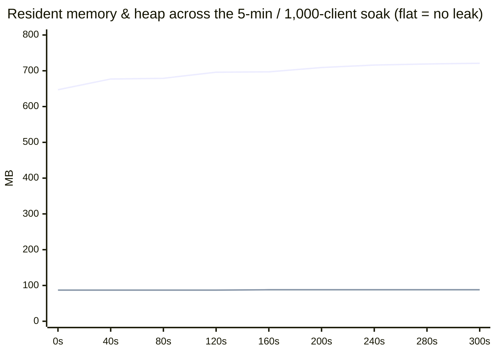
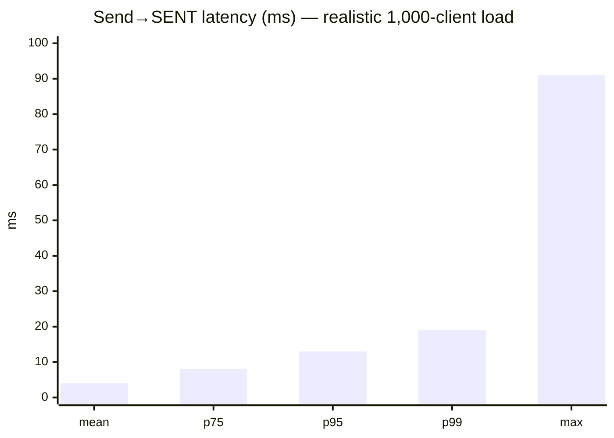
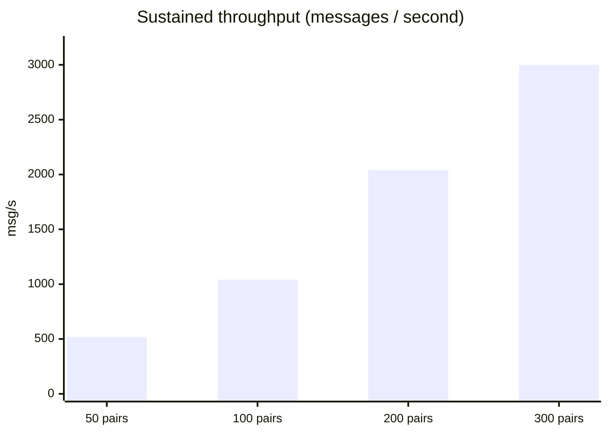
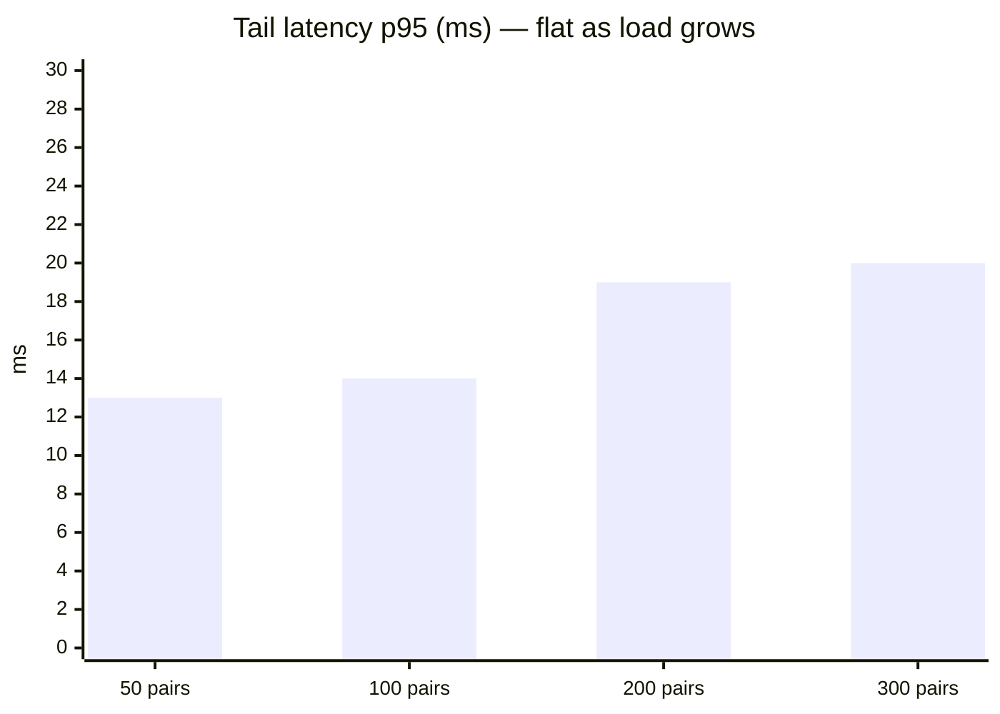
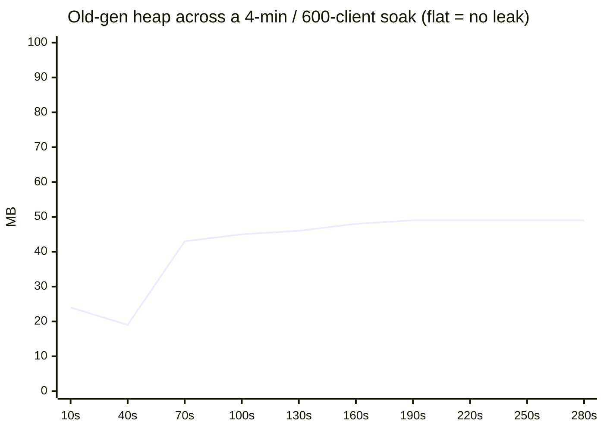

# Performance

Two complementary measurements, both with the Gatling harness in [`loadtest/`](../loadtest) driving
**real WebSockets** (each `CHAT_IN` waits for the server's post-commit `SENT` ack, so every count is a
message that was actually persisted, delivered and acknowledged — not just written to a socket):

1. **Real-world workload** — **1,000 concurrent clients holding natural conversations**: well within
   capacity, p95 13 ms, zero server drops, memory flat.
2. **Peak capacity** — a synthetic stress test that finds the ceiling: **~3,000 messages/second at a
   20 ms p95**, held flat for minutes with no full GC and no growth.

So a thousand people actively chatting is a *fraction* of what one bounded instance handles.

## Real-world workload — 1,000 concurrent clients

This is the headline number, because it reflects how the service is actually used. **500 chat pairs =
1,000 live WebSocket sessions**, ramped over 30 s and held for 5 minutes, each pair holding a
**realistic marketplace conversation**: master and client **take turns**, with **human think-time
(1.5–7 s)** between messages, the recipient **marks each message read** (`READ_IN`), varied message
bodies, and **30 % of clients drop and reconnect mid-chat** then **re-sync history** over REST
(exercising offline-hold + poller re-delivery + reconnect sync).

> Measured 2026-06-29, `load.users=500`, on a single host that **also** runs the load generator,
> PostgreSQL, Redis and MinIO, with the JVM memory **bounded** (see [Memory](#memory--stable-and-smaller-than-it-looks)).

| Signal | Observed | Reading |
|--------|----------|---------|
| Concurrent WS clients | **1,000** (500 pairs), held 5 min | Steady, not a burst. |
| Messages persisted + delivered + acked | **39,535** | Every one fully committed. |
| Total client operations | 123,486 (sends + `READ_IN` receipts + REST create/history) | The full conversation, not just sends. |
| Server-side drops | **0** | Nothing shed. |
| Send→`SENT` latency | mean **4 ms**, p95 **13 ms**, p99 **19 ms**, max 91 ms | Sub-frame, flat across the soak. |
| Errors (KO) | 40 = **0.03 %** | Client-side: frames raced a socket the test closed for its reconnect — no server error. |
| DB pool active | **0–1 of 20** | Human-paced load barely touches persistence. |
| Full GC | **0** | 87 young pauses / 0.40 s total (~4.6 ms avg); GC overhead 0.04 %. |
| Heap used | flat **~88 MB** | Working set settles immediately — no leak. |
| Resident memory (RSS) | plateaus **~0.72 GB** | Real RAM footprint at 1,000 clients. |
| Virtual memory (VIRT) | flat **~3.3 GB** (bounded) | Reservation, not RAM — see below. |

RSS and heap rise to their working set in the first ~90 s and then **stop** — the signature of a
healthy, leak-free service. A leak would keep climbing:



The upper line is RSS (settles ~0.72 GB), the lower is JVM heap-used (flat ~88 MB of the 2 GB `-Xmx`).
Latency stays sub-frame throughout:



## Peak capacity (stress test)

The numbers below come from a **synthetic** run with the think-time removed — every virtual user sends
back-to-back, awaiting each ack — to find the persistence ceiling rather than model real use.

> Measured 2026-06-24 with the same harness driving **real WebSockets**: each virtual user is a chat
> pair that streams `CHAT_IN` and **waits for the server's `SENT` ack** before sending the next one.

## Throughput

Throughput scales almost linearly with concurrency, and tail latency barely moves — the inbound queue
never backs up.





| Chat pairs | WS clients | Throughput (msg/s) | p95 | p99 |
|-----------:|-----------:|-------------------:|----:|----:|
| 50  | 100 | ~520   | 13 ms | 15 ms |
| 100 | 200 | ~1,040 | 14 ms | 16 ms |
| 200 | 400 | ~2,040 | 19 ms | 25 ms |
| 300 | 600 | ~3,000 | 20 ms | 23 ms |

These come from a single host that **also** runs the load generator, PostgreSQL, Redis and MinIO — so
everything fights for the same CPU and disk. Treat them as a **floor**: a real deployment with the
database and clients off-box has room to spare (CPU sat at 7–13% and the DB pool was 95% idle even at
3,000 msg/s).

## The design behind the numbers

A `CHAT_IN` becomes one `message_history` row plus one `outbox` row, committed **before** the message
is delivered and acked. How those rows are committed is the whole story:

- **The inbound pipeline runs in parallel.** `InboundPublisher` processes many `routeIn` flows at
  once instead of one at a time.
- **Writes are group-committed.** `InboundPersistBatcher` (`core/router/persist`) collects the
  concurrent persists — flushing on **whichever comes first, a full batch or a short linger window**
  (`group().intoLists().of(max-size, linger-ms)`) — and writes each group in a **single transaction**
  (`OutboxManager.saveBatch`), running up to `max-concurrent-batches` of them at once. The moment a
  batch commits, each message resumes its own pipeline; delivery, ack, caching and the watermark stay
  **per-message**, and the `SENT` ack is still sent per message.
- **A poison row fails alone.** A batch transaction is all-or-nothing. If one rolls back, the batcher
  retries those messages individually via `OutboxManager.save`. A rolled-back transaction committed
  nothing, so retrying can never double-insert — the one bad row fails, its batch-mates succeed.

This keeps PostgreSQL and the CPU fed enough to clear thousands of messages a second while every
per-message correctness guarantee stays exactly where it was.

### No message is lost

The `SENT` ack is emitted **only after** the database commit (`AckStage` runs after `OutboxStage`). So
an acked message is always persisted. The only thing the load harness's hard time-cutoff drops (~0.8%
in a 4-minute soak) are messages still in flight on connections it kills mid-stream — those get **no
ack**, exactly as a real client whose socket drops would, and are resent on reconnect. In steady state
the server shed **zero** messages.

## Tuning

Every batch parameter is configurable under `processing.messages.inbound.persist-batch`
(env-overridable, `prod` profile). The shipped defaults assume the default 20-connection DB pool:

| Param | Default | Effect |
|-------|---------|--------|
| `max-size` | `64` | Messages per transaction. Higher → fewer commits, higher ceiling. |
| `linger-ms` | `5` | How long a partial batch waits before flushing. The only latency batching adds. |
| `max-concurrent-batches` | `8` | Batch transactions in flight at once. Higher → more parallelism, until the DB saturates. **Keep ≤ the DB pool size.** |

The full set of inbound/outbound/poller knobs lives in the
[README tuning table](../README.md#-performance-tuning).

## Memory — stable, and smaller than it looks

Over a 4-minute soak at 600 live clients the heap is healthy and **flat**: the old generation rises
to its working set and then stops, with no full GC. A leak would keep climbing — this doesn't.



| Signal | Observed | Reading |
|--------|----------|---------|
| Throughput | ~3,000 msg/s, p95 20 ms, flat 4 min | Steady, not a burst. |
| CPU | 7–13% | Not CPU-bound — lots of headroom. |
| DB pool active | 0–8 of 20 | Few fat transactions; the pool is rarely busy. |
| Drops (in/out) | 0 | Nothing shed in steady state. |
| Batch size | avg ~27, max 64 | Healthy coalescing (hits the cap under load). |
| Young GC | ~137 pauses, 0.46 s total | ~3 ms average pause. |
| Full GC | 0 | — |
| Old-gen heap | plateaus ~49 MB | Working set settles — no leak. |
| Resident memory (RSS) | ~0.3 GB idle → ~0.9 GB under load | The real RAM footprint. |

### "Why does it show 25–33 GB?"

Process monitors (the **VIRT** column in `top`/`htop`) show the JVM reserving tens of gigabytes of
*virtual address space* by default — reservation, not use (G1 heap-max region, direct buffers, metaspace,
code cache, a stack per thread, mmap'd jars, and up to `8 × cores` 64 MB glibc malloc arenas). Only
**RSS** costs real memory.

The deployment **bounds the reservation** with `MALLOC_ARENA_MAX=2` plus
`-Xmx2g -XX:MaxDirectMemorySize=1g -XX:MaxMetaspaceSize=256m -XX:ReservedCodeCacheSize=256m`
(`docker-compose.yml`). Measured at **3,000 msg/s (300 chat pairs)**:

| | default | bounded |
|--|--|--|
| VIRT | ~24–33 GB | **~3.4 GB** |
| RSS (under load) | ~2 GB | **~0.8 GB** |
| heap-used peak | — | ~0.36 GB (of 2 GB) |
| old-gen | plateaus | ~45 MB, flat — no leak |
| GC | — | 94 young pauses / 0.26 s, **zero full GC** |
| throughput / p95 | 3,000 / 20 ms | **3,000 / 20 ms — no cost** |

Raise `-Xmx` if a longer soak shows heap pressure (peak heap-used was ~0.36 GB, so 2 GB is ample).

## Hardening for connection churn

When a large number of WebSocket sessions close **at the same instant**, each disconnect fires
presence, Tetris-watermark and idempotency work at Redis simultaneously. The Vert.x Redis client
defaults (pool 6, wait queue 24) reject that burst with `ConnectionPoolTooBusyException`. The shipped
config raises them to **`max-pool-size: 24` / `max-pool-waiting: 2048`**, which eliminated the errors
entirely (34,861 → 0 across an identical 600-client teardown). Sizing this for your peak concurrent
disconnect rate is the one knob to revisit before a high-churn deployment.

## Running it yourself

```bash
# 1. Boot the app (prod profile) against Postgres + Redis + MinIO.
# 2. From loadtest/ (JDK 21):
mvn gatling:test -Dgatling.simulationClass=load.MessengerLoadSimulation \
    -Dload.users=300 -Dload.ramp=15 -Dload.duration=240 -Dload.pauseMs=0
```

`load.users` is the number of concurrent chat pairs; `ramp` and `duration` are in seconds. Watch the
server live at `/q/metrics` — `messenger_persist_batch_*`, `sql_pool_active`, GC and WS-session gauges
tell the whole story. Gatling writes an HTML report under `loadtest/target/gatling/`.
