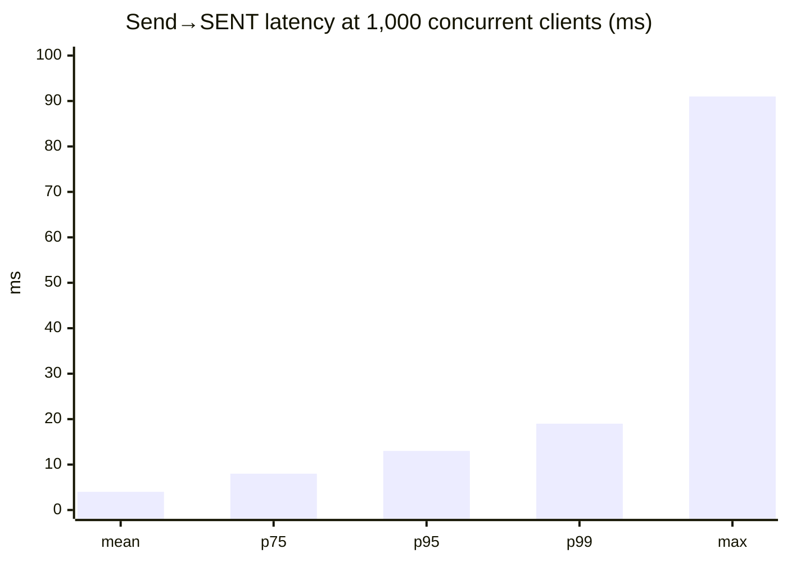
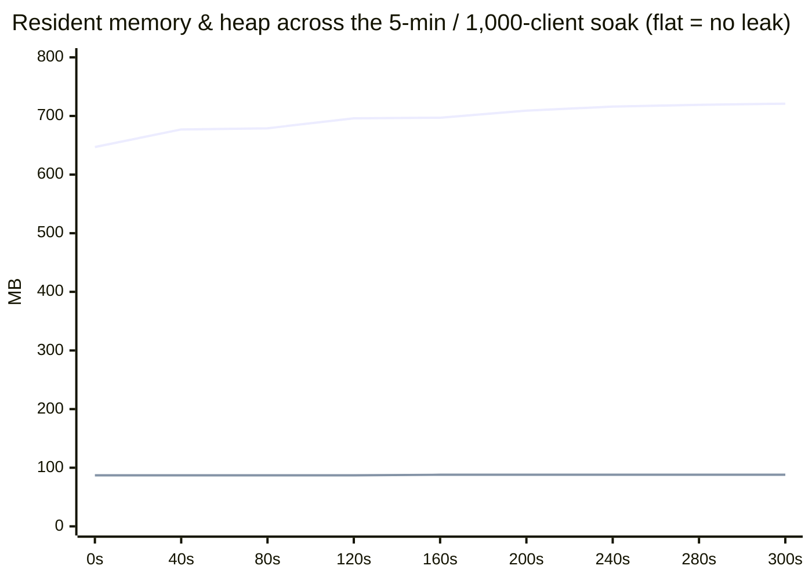
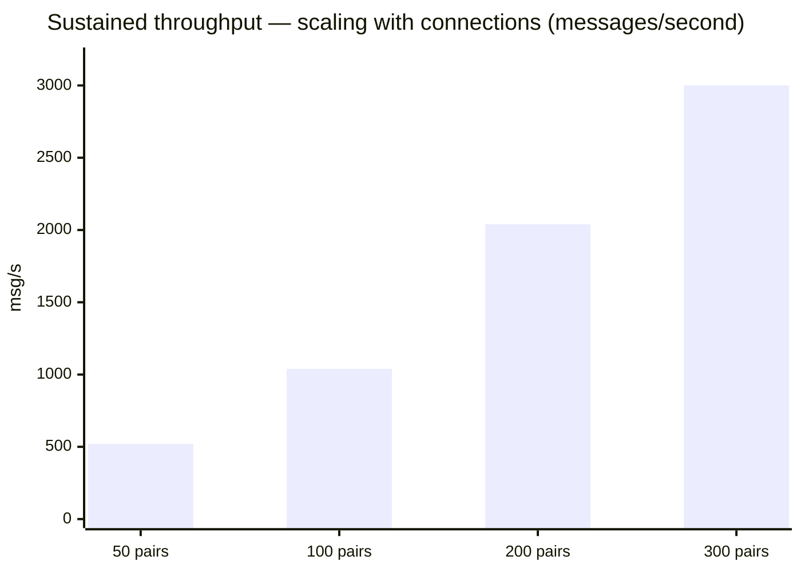

# Performance

The Messenger is built on two promises: **stay calm under real load**, and **refuse load that would
hurt it** rather than fall over. This page proves both with three measurements — a realistic crowd, the
per-connection guard rail, and the raw ceiling — and explains the design choices behind each number.

> **How it's measured.** All runs use the Gatling harness in [`loadtest/`](../loadtest) driving **real
> WebSockets** — no mocks. Every `CHAT_IN` is confirmed by the server's `SENT` ack, which is emitted
> **only after the database commit**, so a counted message is one that was actually persisted,
> delivered and acknowledged. Everything runs on a **single host** that also hosts the load generator,
> PostgreSQL, Redis and MinIO — so all figures are a **floor**; real off-box deployments have more room.
> The JVM runs with its memory **bounded** (see [Memory](#memory)).

## Strategy in four levers

| Lever | What it does | Why it matters |
|-------|--------------|----------------|
| **Per-connection credit flow-control** | Each socket gets a token bucket — burst `100`, refill `10/s`. Excess is refused at ingress with an `overloaded` notice (the client retries). | No single client can flood the server. Aggregate capacity scales with the number of connections, not with any one client's rate. **This guard rail is load-bearing** (see below). |
| **Group-commit persistence** | The parallel inbound pipeline coalesces many `history+outbox` writes into one transaction (`InboundPersistBatcher`), several in flight at once. | Thousands of messages/second on a modest 20-connection DB pool. |
| **Ack-after-commit** | `SENT` is sent only after the DB transaction commits. | An acknowledged message is always durable — never lost across a disconnect. |
| **Bounded JVM** | `-Xmx2g` + capped direct/metaspace/code-cache + `MALLOC_ARENA_MAX=2`. | Flat, small, predictable memory; virtual-address reservation collapses from tens of GB to ~3.3 GB. |

---

## 1. Real-world workload — 1,000 concurrent clients

The headline, because it reflects how the service is actually used. **500 chat pairs = 1,000 live
WebSocket sessions**, ramped over 30 s and held 5 minutes, each pair holding a **realistic marketplace
conversation**: master and client **take turns**, with **human think-time (1.5–7 s)** between messages,
the recipient **marks each message read** (`READ_IN`), varied bodies, and **30 % of clients drop &
reconnect** mid-chat then **re-sync history** over REST.

| Signal | Observed | Reading |
|--------|----------|---------|
| Concurrent WS clients | **1,000**, held 5 min | Steady, not a burst. |
| Messages persisted + delivered + acked | **39,535** | Every one fully committed. |
| Server-side drops | **0** | Nothing shed. |
| Send→`SENT` latency | mean **4 ms**, p95 **13 ms**, p99 **19 ms**, max 91 ms | Sub-frame, flat across the soak. |
| Errors (KO) | 40 = **0.03 %** | Client-side: frames raced a socket the test closed for its own reconnect. |
| DB pool active | **0–1 of 20** | Human-paced load barely touches persistence. |
| Full GC | **0** | 87 young pauses / 0.40 s total (~4.6 ms avg); GC overhead 0.04 %. |
| Heap used / RSS / VIRT | **~88 MB / ~0.72 GB / ~3.3 GB** | Working set settles and stays put. |



Memory rises to its working set in the first ~90 s and then **stops** — the signature of a leak-free
service (the upper line is RSS, the lower is JVM heap-used, flat at ~88 MB of the 2 GB `-Xmx`):



---

## 2. The guard rail — per-connection flow control

Throughput scales with the number of connections, **not** with any single client's send rate, because
each connection is metered by a credit bucket (burst `100`, refill `10/s`). To see it work, we put
**1,200 clients online** and let a rotating set of **abusive senders** each *try* to fire ~100 msg/s —
far above their refill — in three waves (50 % → 100 % → 75 %).

The limiter does exactly its job: each connection is capped near its refill rate, the excess is refused
at ingress with an `overloaded` notice (so a real client backs off and retries — nothing is silently
lost), and **the server stays idle**:

| Signal (1,200 online, abusive senders) | Observed |
|------------------------------------------|----------|
| Online WS clients | **1,200** |
| Accepted throughput per wave (50/100/75 %) | **~525 / ~1,050 / ~775 msg/s** — clean wave shape |
| Offered vs accepted | 924,800 received → 322,107 accepted; the rest **refused by flow-control** (each → an `overloaded` notice, not a loss) |
| Server CPU | **~0.6 %** |
| Full GC / heap / RSS / VIRT | **0** / ~88 MB / ~0.72 GB / ~3.24 GB |
| Inbound queue drops | **0** (excess was shed upstream, at the credit gate) |

### Beyond the guard rail — graceful degradation

What happens if the limiter is bypassed and the persist pipeline is *overloaded* anyway? It must shed,
not stall. We checked by **removing the limiter** (a deliberate test-only override) and fire-hosing
~3,000 msg/s from just **30 connections** with no client-side pacing.

This surfaced — and we fixed — a real defect: the group-commit's timed flush
(`group().intoLists().of(maxSize, lingerMs)`, a `MultiBufferWithTimeoutOp`) emitted batches **ignoring
downstream demand**, so when `merge(maxConcurrentBatches)` was saturated it raised a Mutiny
`BackPressureFailure` and **killed the persist stream** — persistence collapsed to ~0 at 2–3 % CPU (a
backpressure-handling bug, not a resource limit). The fix drains the group through
`onOverflow().invoke(shed).drop()`: the group always has demand (never fails), and genuine overflow
sheds whole batches — each message completed `FAILED` so its sender gets an `overloaded` notice and
retries (never a silent loss).

After the fix, the same brutal run is a non-event — the pipeline **sustained ~3,000 msg/s from 30
connections** and shed almost nothing:

| Signal (limiter off, 30 fire-hose senders) | Before fix | After fix |
|---------------------------------------------|-----------|-----------|
| Persisted (6-min run) | froze at **341,501** | **792,952** |
| Peak-wave throughput | **0** (stalled) | **~3,000 msg/s** |
| `BackPressureFailure` | stream killed | **0** |
| Messages shed | — (all dropped at ingress) | **48** (negligible) |
| Inbound queue drops | ~987k | **0** |
| Full GC / heap / RSS | — | **0** / ~87 MB / ~0.76 GB |

**Takeaways.** (1) In production the credit limiter caps per-connection rate, so this overload regime is
unreachable. (2) Even past it, the persist pipeline now **degrades gracefully** (shed-with-notice) rather
than failing. (3) The persist pipeline's own ceiling is comfortably **above 3,000 msg/s** — the earlier
"stall" was purely the backpressure bug, never a throughput wall.

---

## 3. Peak capacity — ~3,000 messages/second

The ceiling, measured the way the guard rail intends it to be reached: **many paced connections, each
within its credit budget** (≈300 chat pairs, each awaiting its ack before the next send — i.e. ≤ the
`10/s` refill). Sustained for minutes, flat, with **no message loss and no full GC**:



At 300 pairs: **~3,000 msg/s, p95 20 ms**, DB pool ~95 % idle, CPU 7–13 %. The relationship is simple and
by design — **sustainable rate ≈ connections × refill-rate** (300 × 10/s ≈ 3,000/s). To go higher you add
connections (or raise the refill), not the per-client rate.

Putting the three together: a thousand real users chatting (≈120 msg/s of demand) is a **fraction** of
the ~3,000 msg/s ceiling — the system runs that load nearly idle.

---

## The design behind the numbers

A `CHAT_IN` becomes one `message_history` row plus one `outbox` row, committed **before** the message is
delivered and acked. How those rows are committed is the whole throughput story:

- **The inbound pipeline runs in parallel.** `InboundPublisher` processes many `routeIn` flows at once.
- **Writes are group-committed.** `InboundPersistBatcher` (`core/router/persist`) coalesces concurrent
  persists — flushing on **whichever comes first, a full batch or a short linger window**
  (`group().intoLists().of(max-size, linger-ms)`) — and writes each group in **one transaction**
  (`OutboxManager.saveBatch`), up to `max-concurrent-batches` at once. The moment a batch commits, each
  message resumes its own flow; delivery, ack, caching and the watermark stay **per-message**.
- **A poison row fails alone.** A batch transaction is all-or-nothing; on rollback the batcher retries
  those messages individually. A rolled-back transaction committed nothing, so retry can't double-insert.
- **No message is lost.** `SENT` is emitted only after the commit (`AckStage` runs after `OutboxStage`),
  so an acked message is always persisted. A message refused at the credit gate gets an `overloaded`
  notice — the client retries; it is never silently dropped.

## Memory

Process monitors show the JVM reserving tens of GB of *virtual address space* by default (G1 heap-max
region, direct buffers, metaspace, code cache, a stack per thread, mmap'd jars, and up to `8 × cores`
64 MB glibc malloc arenas) — a **reservation, not RAM**. Only RSS costs real memory. The deployment
bounds the reservation with `MALLOC_ARENA_MAX=2` plus
`-Xmx2g -XX:MaxDirectMemorySize=1g -XX:MaxMetaspaceSize=256m -XX:ReservedCodeCacheSize=256m`
(`docker-compose.yml`):

| | default | bounded |
|--|--|--|
| VIRT | ~24–33 GB | **~3.3 GB** |
| RSS (under load) | ~2 GB | **~0.7–0.9 GB** |
| heap-used | — | flat ~88 MB (of 2 GB) |
| Full GC | — | **0** |
| throughput / latency | — | **unchanged — no cost** |

## Tuning

Configurable under `processing.messages` (env-overridable, `prod` profile):

| Param | Default | Effect |
|-------|---------|--------|
| `credits.max-value` | `100` | Per-connection burst allowance. |
| `credits.refill-rate-per-s` | `10` | Per-connection sustained rate. **Aggregate ceiling ≈ connections × this.** Raising it weakens the abuse guard — change with care. |
| `inbound.persist-batch.max-size` | `64` | Messages per transaction. Higher → fewer commits, higher ceiling. |
| `inbound.persist-batch.linger-ms` | `5` | How long a partial batch waits before flushing. The only latency batching adds. |
| `inbound.persist-batch.max-concurrent-batches` | `8` | Batch transactions in flight. **Keep ≤ the DB pool size.** |
| `redis.max-pool-size` / `max-pool-waiting` | `24` / `2048` | Sized for connection-churn storms (mass simultaneous disconnects). |

## Running it yourself

```bash
# Boot the app (prod profile) against Postgres + Redis + MinIO, then from loadtest/ (JDK 21):

# Realistic conversation workload (§1):
mvn gatling:test -Dgatling.simulationClass=load.MessengerLoadSimulation \
    -Dload.users=500 -Dload.ramp=30 -Dload.duration=300

# Online-pool + rotating senders, load waves (§2):
mvn gatling:test -Dgatling.simulationClass=load.MessengerWaveSimulation \
    -Dload.pool=1170 -Dload.activeFull=30 -Dload.waveSec=140
```

Watch the server live at `/q/metrics` — `messenger_persist_batch_*`, `agroal_active_count`,
`http_server_websocket_connections_seconds_active_count`, GC and `incoming_dropped_total` tell the whole
story. Gatling writes an HTML report under `loadtest/target/gatling/`.
